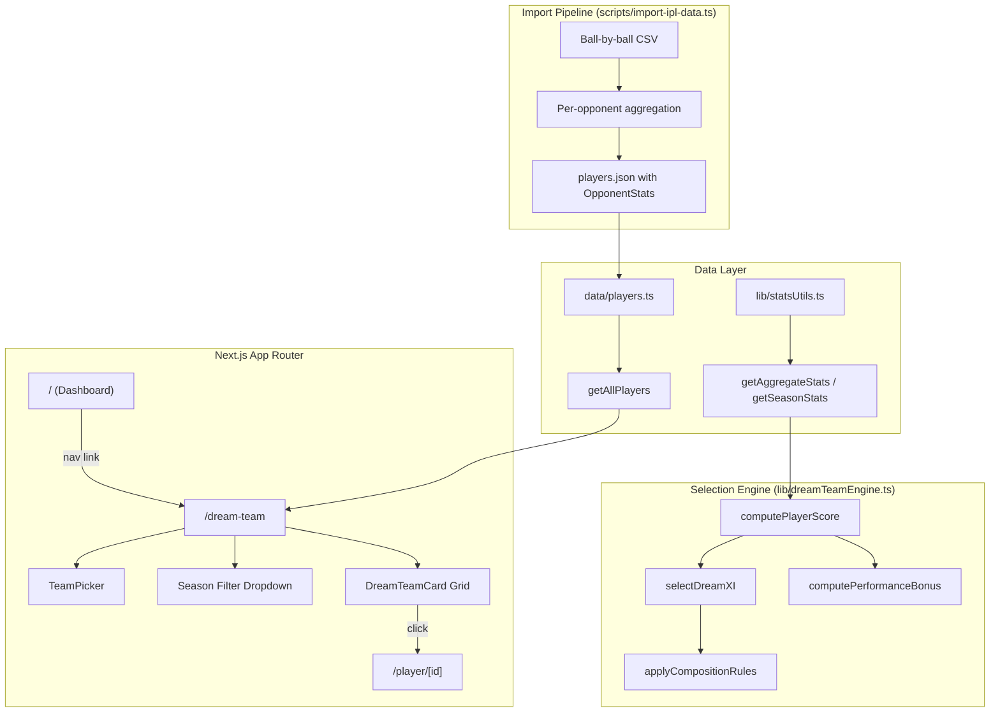

# Design Document: Dream Team Selector

## Overview

The Dream Team Selector feature adds a new page at `/dream-team` where users pick two IPL teams and the system generates an optimal playing XI of 11 players drawn from both squads. A Selection Engine scores each player using career batting/bowling stats (or season-specific stats when a season filter is active) and applies a performance-weighted bonus based on actual per-opponent statistics derived from ball-by-ball match data. Rather than a flat head-to-head multiplier, the system compares a player's batting average/strike rate and bowling economy/average against the specific opponent to their overall career numbers, producing a ratio-based bonus capped at [0.85, 1.25] with small-sample dampening. The resulting Dream XI respects standard cricket composition rules (minimum batters, bowlers, wicket-keeper, all-rounder cap) and is displayed grouped by role with team color-coding.

The feature reuses the existing `Player` data model, `data/players.ts` data layer, and `lib/statsUtils.ts` aggregation utilities. New code consists of:
- Per-opponent data types (`OpponentBattingStats`, `OpponentBowlingStats`, `OpponentStats`) in `data/types.ts`
- Per-opponent aggregation in the import script (`scripts/import-ipl-data.ts`)
- A pure scoring/selection engine in `lib/dreamTeamEngine.ts` with a `computePerformanceBonus()` function
- A new Next.js page at `app/dream-team/page.tsx`
- Two new UI components: `TeamPicker` and `DreamTeamCard`
- A navigation link from the main dashboard

All selection logic is pure and deterministic, making it fully testable without rendering.

## Architecture



### Routing

| Route | Description |
|---|---|
| `/dream-team` | Dream Team Selector page with team pickers, season filter, and generated XI display |

### Key Design Decisions

1. **Pure selection engine** — All scoring and team selection logic lives in `lib/dreamTeamEngine.ts` as pure functions with no side effects. This makes the core algorithm fully unit-testable and property-testable without DOM or React.
2. **Reuse existing data layer** — Player data comes from `getAllPlayers()` and stats from `getAggregateStats()` / `getSeasonStats()`, avoiding duplication.
3. **Normalized scoring** — Batting and bowling scores are normalized to a 0–100 scale so that batters, bowlers, and all-rounders are comparable. All-rounders receive a weighted combination of both components.
4. **Greedy constrained selection** — Players are sorted by score, then selected greedily while respecting composition constraints. Mandatory slots (min batters, min bowlers, min 1 WK) are filled first, then remaining slots go to highest-scoring available players.
5. **Client-side computation** — The dataset is small (~248 players, ~30 per team), so scoring and selection happen client-side for instant feedback.
6. **CSS variable theming** — All new components use inline `style` with CSS variables (`var(--bg-card)`, etc.) consistent with the existing codebase pattern. No Tailwind `dark:` classes.
7. **Performance-weighted bonus replaces flat H2H** — The previous flat `1.1×` head-to-head multiplier is replaced by a ratio-based `computePerformanceBonus()` that compares opponent-specific stats to career averages. This produces a multiplier in [0.85, 1.25] that rewards genuine matchup advantages and penalizes poor matchup history.
8. **Small-sample dampening** — When a player has fewer than 3 innings against an opponent (batting or bowling), the bonus is dampened proportionally (`innings / 3`) to avoid overweighting sparse data.
9. **Per-opponent stats at the season level** — `OpponentStats` are stored per-season inside `SeasonStats`, allowing both season-filtered and cross-season aggregation. The import script derives opponent identity from `BattingTeam` and the match teams mapping.

## Components and Interfaces

### Page Component

#### `app/dream-team/page.tsx` — Dream Team Selector Page
- Client component (needs state for team selection, season filter, generated XI)
- Manages state: `teamA`, `teamB`, `selectedSeason`, `dreamXI`, `compositionNotice`
- Loads all players via `getAllPlayers()`
- Derives available teams and seasons from player data
- Calls `selectDreamXI()` when user clicks "Generate Dream XI"
- Renders `TeamPicker`, optional season filter dropdown, and grid of `DreamTeamCard` components grouped by role
- Displays team summary (count from each team) and composition notice if constraints were relaxed

### UI Components

| Component | Props | Responsibility |
|---|---|---|
| `TeamPicker` | `teams: string[], teamA: string \| null, teamB: string \| null, onChangeA, onChangeB` | Two dropdown selects for team selection; shows validation message when same team selected for both |
| `DreamTeamCard` | `player: Player, score: number, teamLabel: "A" \| "B"` | Displays player name (as link to detail), role, team, key stats, and computed score; visually distinguishes team A vs team B via team color-coding |

### Engine Functions (`lib/dreamTeamEngine.ts`)

| Function | Signature | Description |
|---|---|---|
| `computeBattingScore` | `(stats: AggregateStats["batting"]) => number` | Computes normalized batting score (0–100) from average, strike rate, and total runs |
| `computeBowlingScore` | `(stats: AggregateStats["bowling"]) => number` | Computes normalized bowling score (0–100) from wickets, bowling average, and economy |
| `computePerformanceBonus` | `(player: Player, opponentTeam: string, season?: string) => number` | Computes a ratio-based performance multiplier in [0.85, 1.25] by comparing opponent-specific stats to career averages, with small-sample dampening for < 3 innings |
| `computePlayerScore` | `(player: Player, opponentTeam: string, allPlayers?: Player[], season?: string) => number` | Computes composite Player_Score combining batting/bowling components with performance-weighted bonus via `computePerformanceBonus()` |
| `selectDreamXI` | `(players: Player[], teamA: string, teamB: string, season?: string) => DreamXIResult` | Filters players to the two teams, scores them, applies composition rules, and returns the best 11 with metadata |
| `getTeamsFromPlayers` | `(players: Player[]) => string[]` | Extracts sorted unique team names from the player dataset |
| `getSeasonsFromPlayers` | `(players: Player[]) => string[]` | Extracts sorted unique season years from the player dataset |

### Import Script Changes (`scripts/import-ipl-data.ts`)

The import script is updated to track per-opponent statistics during ball-by-ball processing:

| Change | Description |
|---|---|
| `OpponentSeasonData` tracking | New per-opponent counters added to `PlayerSeasonData`: a `Map<string, OpponentSeasonData>` keyed by opponent team name, tracking batting (runs, ballsFaced, innings, dismissals) and bowling (runsConceded, ballsBowled, innings, wickets) per opponent |
| Opponent identification | During ball processing, `bowlingTeam` is derived as `battingTeam === matchInfo.team1 ? matchInfo.team2 : matchInfo.team1` (already computed). Each delivery updates the opponent-specific counters for both batter and bowler |
| Output serialization | The `opponentStats` map is written into each `SeasonStats` entry in `players.json`, omitting opponents with zero deliveries |

## Data Models

### New TypeScript Interfaces

```typescript
/** Per-opponent batting statistics derived from ball-by-ball data */
interface OpponentBattingStats {
  innings: number;
  runs: number;
  ballsFaced: number;
  dismissals: number;
}

/** Per-opponent bowling statistics derived from ball-by-ball data */
interface OpponentBowlingStats {
  innings: number;
  runsConceded: number;
  ballsBowled: number;
  wickets: number;
}

/** Combined per-opponent stats record */
interface OpponentStats {
  batting?: OpponentBattingStats;
  bowling?: OpponentBowlingStats;
}
```

The existing `SeasonStats` interface in `data/types.ts` gains an optional field:

```typescript
interface SeasonStats {
  year: string;
  team: string;
  batting?: BattingStats;
  bowling?: BowlingStats;
  fielding?: FieldingStats;
  /** Per-opponent performance stats, keyed by opponent team name */
  opponentStats?: Record<string, OpponentStats>;
}
```

```typescript
/** A scored player entry in the Dream XI */
interface ScoredPlayer {
  player: Player;
  score: number;
  /** Which selected team this player belongs to */
  teamLabel: "A" | "B";
}

/** Result of the dream XI selection */
interface DreamXIResult {
  /** The 11 selected players with scores */
  players: ScoredPlayer[];
  /** True if composition constraints had to be relaxed */
  compositionRelaxed: boolean;
  /** Count of players from team A */
  teamACount: number;
  /** Count of players from team B */
  teamBCount: number;
}

/** Composition constraints for the Dream XI */
interface CompositionRules {
  totalPlayers: 11;
  minBatters: 3;        // primaryRole === "Batter" (excluding all-rounders)
  minBowlers: 3;        // primaryRole === "Bowler" (excluding all-rounders)
  minWicketKeepers: 1;  // secondaryRole === "Wicket-Keeper"
  maxAllRounders: 4;    // secondaryRole === "All-Rounder"
  minPerTeam: 1;        // at least 1 player from each team
}
```

### Scoring Formula

**Batting Score** (0–100):
- `battingScore = 0.4 × clamp(average / 50, 0, 1) × 100 + 0.35 × clamp(strikeRate / 200, 0, 1) × 100 + 0.25 × clamp(runs / 5000, 0, 1) × 100`

**Bowling Score** (0–100):
- `bowlingScore = 0.4 × clamp(wickets / 150, 0, 1) × 100 + 0.35 × (1 - clamp(economy / 12, 0, 1)) × 100 + 0.25 × (1 - clamp(bowlingAverage / 40, 0, 1)) × 100`

**Composite Score**:
- Batters / Wicket-Keepers: `battingScore`
- Bowlers: `bowlingScore`
- All-Rounders: `0.5 × battingScore + 0.5 × bowlingScore`

**Performance-Weighted Bonus** (replaces the previous flat 1.1× head-to-head bonus):

The `computePerformanceBonus(player, opponentTeam, season?)` function works as follows:

1. **Aggregate opponent stats**: Collect `OpponentStats` for the given opponent across all seasons (or the filtered season). Sum up batting counters (runs, ballsFaced, innings, dismissals) and bowling counters (runsConceded, ballsBowled, innings, wickets).

2. **Compute opponent-specific derived stats**:
   - Opponent batting average = `opponentRuns / opponentDismissals` (or `opponentRuns` if 0 dismissals)
   - Opponent strike rate = `(opponentRuns / opponentBallsFaced) × 100`
   - Opponent bowling economy = `(opponentRunsConceded / opponentBallsBowled) × 6`
   - Opponent bowling average = `opponentRunsConceded / opponentWickets` (or 0 if 0 wickets)

3. **Compute ratios against career stats**:
   - Batting ratio = `(opponentBatAvg / careerBatAvg + opponentSR / careerSR) / 2`
   - Bowling ratio = `(careerBowlEcon / opponentBowlEcon + careerBowlAvg / opponentBowlAvg) / 2` (inverted because lower is better for bowling)
   - For All-Rounders: `ratio = (battingRatio + bowlingRatio) / 2`
   - For pure Batters/WK: `ratio = battingRatio`
   - For pure Bowlers: `ratio = bowlingRatio`

4. **Small-sample dampening**: If batting innings < 3, dampen batting ratio toward 1.0: `dampened = 1.0 + (ratio - 1.0) × (innings / 3)`. Same for bowling innings < 3.

5. **Clamp**: Final multiplier = `clamp(ratio, 0.85, 1.25)`

6. **Apply**: `finalScore = baseScore × performanceBonus`

When a player has no `OpponentStats` against the opponent at all, the bonus is `1.0` (no effect).

### Existing Interfaces Reused

- `Player`, `SeasonStats`, `BattingStats`, `BowlingStats`, `AggregateStats` from `data/types.ts`
- `getAggregateStats()`, `getSeasonStats()` from `lib/statsUtils.ts`
- `getAllPlayers()`, `getPlayerById()` from `data/players.ts`


## Correctness Properties

*A property is a characteristic or behavior that should hold true across all valid executions of a system — essentially, a formal statement about what the system should do. Properties serve as the bridge between human-readable specifications and machine-verifiable correctness guarantees.*

### Property 1: Generate button enabled iff two distinct teams selected

*For any* pair of team selections (teamA, teamB) where both may be null or any team string, the "Generate Dream XI" button should be enabled if and only if teamA and teamB are both non-null and teamA !== teamB. When teamA === teamB and both are non-null, a validation message should be present.

**Validates: Requirements 1.3, 1.4, 1.5**

### Property 2: Score uses correct role-based components

*For any* player with known primaryRole and secondaryRole, the computed Player_Score should equal: the batting score alone when the player is a pure Batter or Wicket-Keeper (no All-Rounder secondary role), the bowling score alone when the player is a pure Bowler, or a weighted combination of both batting and bowling scores when the player has the All-Rounder secondary role.

**Validates: Requirements 2.2, 2.3, 2.4**

### Property 3: Performance bonus clamping invariant

*For any* player and any set of opponent statistics (including extreme values), the performance-weighted bonus multiplier returned by `computePerformanceBonus()` should always be in the range [0.85, 1.25]. When the player has no opponent stats against the given opponent, the bonus should be exactly 1.0.

**Validates: Requirements 11.4, 2.6**

### Property 4: Score normalization range

*For any* player with valid batting and/or bowling statistics, the base Player_Score (before head-to-head bonus) should be in the range [0, 100].

**Validates: Requirements 2.6**

### Property 5: Dream XI composition constraints

*For any* two distinct teams with sufficient players of each role, the Dream XI result should satisfy all of the following simultaneously: exactly 11 players selected, at least 1 Wicket-Keeper, at least 3 pure Batters, at least 3 pure Bowlers, at most 4 All-Rounders, and at least 1 player from each of the two selected teams.

**Validates: Requirements 3.1, 3.2, 3.3, 3.4, 3.5, 3.7**

### Property 6: Season filter restricts players and stats

*For any* season filter value and any two teams, every player in the resulting Dream XI should have season data for the filtered season, and no player lacking data for that season should appear in the result. When no season filter is applied, the score should be based on aggregate career stats.

**Validates: Requirements 5.2, 5.3, 5.4**

### Property 7: Dream Team Card displays required information

*For any* scored player in the Dream XI, the rendered Dream_Team_Card should contain the player's name, team name, primary role, secondary role (if present), and the computed Player_Score value.

**Validates: Requirements 4.2**

### Property 8: Opponent derived stats correctness

*For any* `OpponentBattingStats` with positive `ballsFaced` and positive `dismissals`, the derived batting average should equal `runs / dismissals` and the derived strike rate should equal `(runs / ballsFaced) × 100`. *For any* `OpponentBowlingStats` with positive `ballsBowled` and positive `wickets`, the derived bowling economy should equal `(runsConceded / ballsBowled) × 6` and the derived bowling average should equal `runsConceded / wickets`.

**Validates: Requirements 9.4, 9.5**

### Property 9: Performance bonus uses role-appropriate comparison

*For any* player with opponent stats, the `computePerformanceBonus()` function should use only batting ratios (opponent batting avg/SR vs career batting avg/SR) for pure Batters and Wicket-Keepers, only bowling ratios (opponent bowling econ/avg vs career bowling econ/avg) for pure Bowlers, and a combination of both batting and bowling ratios for All-Rounders.

**Validates: Requirements 11.1, 11.2, 11.3**

### Property 10: Small-sample dampening reduces bonus magnitude

*For any* player with fewer than 3 batting innings or fewer than 3 bowling innings against an opponent, the performance bonus should be closer to 1.0 than the undampened bonus value. Specifically, for `n` innings where `n < 3`, the deviation from 1.0 should be scaled by `n / 3`.

**Validates: Requirements 11.5**

### Property 11: Better opponent performance yields bonus above 1.0

*For any* player whose opponent-specific batting average and strike rate are both strictly greater than their career batting average and strike rate (with sufficient sample size ≥ 3 innings), the performance bonus should be greater than 1.0. Conversely, *for any* player whose opponent-specific stats are both strictly worse than career stats, the bonus should be less than 1.0.

**Validates: Requirements 11.6, 2.5**

## Error Handling

| Scenario | Handling |
|---|---|
| Same team selected for both slots | Show inline validation message "Please select two different teams"; keep Generate button disabled |
| Fewer than two teams selected | Keep Generate button disabled with no error message |
| Composition constraints cannot be fully satisfied | Relax constraints, fill remaining slots with highest-scoring players, display notice "Composition is approximate — not enough players in some roles" |
| Season filter yields no eligible players from one or both teams | Show message "Not enough players with data for the selected season" and do not generate a Dream XI |
| Player data is empty or missing | Show "No player data available" message on the page |
| Navigation to `/dream-team` with no data | Gracefully show empty state with team pickers still functional |
| Player has no opponent stats for the selected opponent | `computePerformanceBonus()` returns 1.0 (no bonus/penalty), score is unchanged |
| Player has very few innings against opponent (< 3) | Bonus is dampened toward 1.0 proportionally to sample size, preventing extreme multipliers from sparse data |
| Career stats are zero (e.g., 0 batting average) | `computePerformanceBonus()` returns 1.0 to avoid division by zero in ratio computation |

## Testing Strategy

### Property-Based Testing

Library: **fast-check** (already installed in the project).

Each property test must:
- Run a minimum of 100 iterations
- Reference its design document property with a tag comment
- Tag format: `Feature: dream-team-selector, Property {number}: {property_text}`

Property tests target the pure engine functions in `lib/dreamTeamEngine.ts`:
- `computeBattingScore`, `computeBowlingScore`, `computePlayerScore` — Properties 2, 4
- `computePerformanceBonus` — Properties 3, 8, 9, 10, 11
- `selectDreamXI` — Properties 5, 6
- UI state logic — Property 1

Property 7 (card display) will use fast-check to generate random `ScoredPlayer` objects and verify the rendered output contains all required fields via `@testing-library/react`.

### Unit Testing

Library: **Vitest** with **@testing-library/react** for component tests.

Unit tests focus on:
- Specific examples: generating a Dream XI from two known teams and verifying expected players appear
- Edge cases: teams with very few players, all players being the same role, season filter yielding no players
- Error conditions: same team selected twice, no teams selected
- Performance bonus edge cases: player with no opponent stats (bonus = 1.0), player with zero career stats (bonus = 1.0), player with exactly 3 innings (no dampening), player with 1 innings (heavy dampening)
- Integration: verifying the Dream Team page renders team pickers, generates results on button click, and navigates to player detail on card click
- Navigation: dashboard link to `/dream-team` exists, back link to `/` exists on dream team page

### Test Organization

```
__tests__/
  utils/
    dreamTeamEngine.test.ts    — Property tests for scoring and selection logic (Properties 2-6, 8-11)
  components/
    DreamTeamCard.test.tsx     — Property test for card display (Property 7) + unit tests
    TeamPicker.test.tsx        — Property test for validation logic (Property 1) + unit tests
    DreamTeamPage.test.tsx     — Integration unit tests for page behavior
```

### Test Coverage Goals

- All 11 correctness properties implemented as property-based tests
- Unit tests for each edge case and error condition
- Component tests for rendering correctness of `TeamPicker`, `DreamTeamCard`, and the page layout
