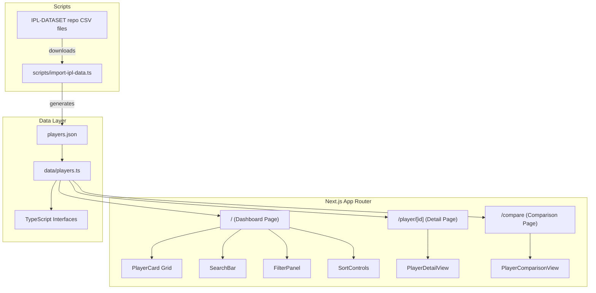

# Design Document: IPL Player Stats

## Overview

This design describes an IPL Player Statistics application built with Next.js (App Router), TypeScript, and Tailwind CSS. The app serves as a fantasy cricket research tool, allowing users to browse, search, filter, sort, and compare IPL player performance data stored locally as typed JSON.

The application consists of three main views:
1. **Stats Dashboard** — grid of player cards with search, filter, and sort controls
2. **Player Detail View** — season-by-season breakdown for a single player
3. **Player Comparison View** — side-by-side stat comparison of 2–4 players

All data is static and loaded from local JSON files at build/request time. No backend API or database is required. Player data is sourced from the open-source [IPL-DATASET](https://github.com/ritesh-ojha/IPL-DATASET) repository and can be refreshed via `npm run import-data`. The dev server runs on port 4000.

## Architecture



### Routing

| Route | Description |
|---|---|
| `/` | Stats Dashboard with player cards, search, filters, sort |
| `/player/[id]` | Detailed player view with season-by-season stats |
| `/compare?ids=id1,id2,...` | Side-by-side comparison of 2–4 players |

### Key Design Decisions

1. **Static JSON data** — Player data lives in `data/players.json` with a typed loader in `data/players.ts`. Data is generated from the open-source IPL-DATASET repository via `scripts/import-ipl-data.ts` and refreshable with `npm run import-data`.
2. **Client-side filtering/sorting** — Since the dataset is moderate (~248 players), all search, filter, and sort operations happen client-side for instant feedback.
3. **URL-based comparison** — Selected player IDs for comparison are passed via query params (`/compare?ids=...`), making comparison views shareable and bookmarkable.
4. **Component-driven UI** — Reusable components (`PlayerCard`, `SearchBar`, `FilterPanel`, `SortControls`) keep the dashboard composable and testable.
5. **Dual name fields** — Players have an official IPL abbreviated `name` (e.g., "V Suryavanshi") shown on cards, and an optional `originalName` with their full name (e.g., "Vaibhav Suryavanshi") shown on detail/comparison views. Search matches against both fields.

## Components and Interfaces

### Page Components

#### `app/page.tsx` — Dashboard Page
- Client component (needs state for search/filter/sort)
- Loads all players from data layer
- Manages state: `searchQuery`, `activeFilters`, `sortConfig`, `selectedForComparison`
- Renders `SearchBar`, `FilterPanel`, `SortControls`, and a grid of `PlayerCard` components
- Shows "No results found" when filtered list is empty

#### `app/player/[id]/page.tsx` — Player Detail Page
- Server component that reads player ID from params
- Loads player data and renders `PlayerDetailView`
- Shows error message + link back to dashboard if player not found

#### `app/compare/page.tsx` — Comparison Page
- Client component that reads `ids` from search params
- Loads selected players and renders `PlayerComparisonView`
- Validates 2–4 players selected; shows prompt if fewer than 2

### UI Components

| Component | Props | Responsibility |
|---|---|---|
| `PlayerCard` | `player: Player, season?: string, selected: boolean, onToggleSelect` | Displays summary stats using official IPL abbreviated `name`; shows batting/bowling stats based on role |
| `SearchBar` | `query: string, onChange` | Text input for name search |
| `FilterPanel` | `filters: FilterState, onChange, teams: string[], seasons: string[]` | Dropdowns/buttons for role, team, season filters |
| `SortControls` | `sortConfig: SortConfig, onChange` | Sort criterion selector with ascending/descending toggle |
| `PlayerDetailView` | `player: Player` | Full player profile showing `originalName ?? name`, with season-by-season table |
| `PlayerComparisonView` | `players: Player[]` | Side-by-side stat table showing `originalName ?? name`, with highlighted best values |

### Utility Functions

| Function | Signature | Description |
|---|---|---|
| `filterPlayers` | `(players: Player[], filters: FilterState, searchQuery: string) => Player[]` | Applies search (matches against both `name` and `originalName`) + filters to player list |
| `sortPlayers` | `(players: Player[], config: SortConfig) => Player[]` | Sorts player list by selected stat |
| `getPlayerById` | `(id: string) => Player \| undefined` | Looks up a single player |
| `getAllPlayers` | `() => Player[]` | Returns all players from the data store |
| `getAggregateStats` | `(player: Player) => AggregateStats` | Computes career totals from season data |
| `getSeasonStats` | `(player: Player, season: string) => SeasonStats \| undefined` | Gets stats for a specific season |
| `getStatValue` | `(player: Player, statKey: string, season?: string) => number` | Extracts a numeric stat value for sorting/comparison |

## Data Models

### TypeScript Interfaces

```typescript
interface Player {
  id: string;
  name: string;
  originalName?: string;
  team: string;
  role: "Batter" | "Bowler" | "All-Rounder" | "Wicket-Keeper";
  nationality: string;
  seasons: SeasonStats[];
}

interface SeasonStats {
  year: string;
  team: string;
  batting?: BattingStats;
  bowling?: BowlingStats;
}

interface BattingStats {
  matches: number;
  innings: number;
  runs: number;
  average: number;
  strikeRate: number;
  fifties: number;
  hundreds: number;
  highestScore: number;
}

interface BowlingStats {
  matches: number;
  innings: number;
  wickets: number;
  economy: number;
  average: number;
  bestFigures: string;
  fourWickets: number;
  fiveWickets: number;
}

interface FilterState {
  role: string | null;
  team: string | null;
  season: string | null;
}

interface SortConfig {
  key: string;
  direction: "asc" | "desc";
}

interface AggregateStats {
  batting?: {
    matches: number;
    runs: number;
    average: number;
    strikeRate: number;
  };
  bowling?: {
    matches: number;
    wickets: number;
    economy: number;
    average: number;
  };
}
```

### JSON Data Structure

Player data is stored in `data/players.json` as an array of `Player` objects. The file includes 248 players across 4 IPL seasons (2022–2025), sourced from the open-source IPL-DATASET repository and generated via `scripts/import-ipl-data.ts`. Each player has season-specific stats, with batting and/or bowling stats depending on their role:

- **Batters**: `batting` stats in each season
- **Bowlers**: `bowling` stats in each season
- **All-Rounders**: both `batting` and `bowling` stats
- **Wicket-Keepers**: `batting` stats (treated similarly to batters for stat display)

Players may include an `originalName` field with their full name (e.g., "Vaibhav Suryavanshi") alongside the abbreviated IPL `name` (e.g., "V Suryavanshi"). Approximately 135+ players have `originalName` mapped.


## Correctness Properties

*A property is a characteristic or behavior that should hold true across all valid executions of a system — essentially, a formal statement about what the system should do. Properties serve as the bridge between human-readable specifications and machine-verifiable correctness guarantees.*

### Property 1: Role-appropriate stat display

*For any* player, if their role is Batter or Wicket-Keeper, the player card output should contain batting stats (matches, runs, average, strike rate); if their role is Bowler, it should contain bowling stats (matches, wickets, economy, average); if their role is All-Rounder, it should contain both batting and bowling stats.

**Validates: Requirements 1.4, 1.5**

### Property 2: Search filters by name substring (case-insensitive)

*For any* list of players and any non-empty search query string, the filtered result should contain only players whose `name` or `originalName` includes the query as a case-insensitive substring, and should contain all such players.

**Validates: Requirements 2.1, 2.4**

### Property 3: Empty search is identity

*For any* list of players and any filter state, filtering with an empty search query should produce the same result as filtering with no search query applied.

**Validates: Requirements 2.2**

### Property 4: Single-dimension filter correctness

*For any* list of players and any single filter value (role or team), every player in the filtered result should match the selected filter value, and every player matching that value in the original list should appear in the result.

**Validates: Requirements 3.4, 3.5**

### Property 5: Season filter returns season-specific stats

*For any* list of players and any selected season, the filtered result should contain only players who have stats for that season, and the stats displayed should correspond to that specific season's data.

**Validates: Requirements 3.6**

### Property 6: Filter composition is intersection

*For any* list of players and any combination of active filters (role, team, season, search), the result should equal the intersection of applying each filter individually.

**Validates: Requirements 3.7**

### Property 7: Aggregate stats are correct sums

*For any* player with season data, the aggregate career batting runs should equal the sum of all season batting runs, and aggregate bowling wickets should equal the sum of all season bowling wickets.

**Validates: Requirements 4.4**

### Property 8: Comparison view shows matching stat rows

*For any* set of 2 to 4 players, the comparison output should contain the same set of stat category rows for each player, and each row should contain a value for every compared player.

**Validates: Requirements 5.2, 5.3**

### Property 9: Superior stat highlighting

*For any* set of 2 to 4 players and any stat category row in the comparison view, the highlighted value should be the best value among the compared players (highest for runs, wickets, strike rate; lowest for economy, bowling average).

**Validates: Requirements 5.5**

### Property 10: Sort ordering

*For any* list of players and any sort criterion, the sorted result should be in descending order by that statistic — meaning each player's stat value is greater than or equal to the next player's stat value.

**Validates: Requirements 6.2**

### Property 11: Sort toggle is involution

*For any* sort state, toggling the sort direction twice on the same criterion should produce the original sort order. Equivalently, sorting ascending then descending by the same key should produce the reverse of each other.

**Validates: Requirements 6.3**

### Property 12: Player JSON round-trip

*For any* valid Player object, `JSON.parse(JSON.stringify(player))` should produce an object deeply equal to the original player.

**Validates: Requirements 8.5**

## Error Handling

| Scenario | Handling |
|---|---|
| Player ID not found in data store | Show "Player not found" message with link back to dashboard (Req 4.5) |
| Fewer than 2 players selected for comparison | Show prompt message asking user to select at least 2 players (Req 5.4) |
| No players match current filters/search | Show "No results found" message on dashboard (Req 1.3) |
| Invalid or missing JSON data | Application should fail gracefully at build time with clear TypeScript errors |
| Malformed query params on compare page | Treat invalid IDs as missing; if fewer than 2 valid players remain, show the selection prompt |

## Testing Strategy

### Property-Based Testing

Library: **fast-check** (`fast-check` npm package) for TypeScript property-based testing.

Each property test must:
- Run a minimum of 100 iterations
- Reference its design document property with a tag comment
- Tag format: `Feature: ipl-player-stats, Property {number}: {property_text}`

Property tests target the pure utility functions (`filterPlayers`, `sortPlayers`, `getAggregateStats`, `getStatValue`) and data model validation. These functions are the core logic and are fully testable without rendering.

### Unit Testing

Library: **Vitest** for unit test runner (compatible with Next.js and fast-check).

Unit tests focus on:
- Specific examples demonstrating correct behavior (e.g., searching for "Kohli" returns Virat Kohli)
- Edge cases: empty player list, player with no batting stats, comparison with exactly 2 and exactly 4 players
- Error conditions: invalid player ID lookup, fewer than 2 players for comparison
- Integration: verifying that page components render expected content for known test data

### Test Organization

```
__tests__/
  utils/
    filterPlayers.test.ts      — Property tests for filtering logic
    sortPlayers.test.ts        — Property tests for sorting logic
    aggregateStats.test.ts     — Property tests for stat aggregation
    playerData.test.ts         — Round-trip and data invariant tests
  components/
    PlayerCard.test.tsx        — Unit tests for stat display by role
    PlayerComparison.test.tsx  — Unit tests for comparison highlighting
```

### Test Coverage Goals

- All 12 correctness properties implemented as property-based tests
- Unit tests for each edge case and error condition identified in requirements
- Component tests for rendering correctness of key UI components
