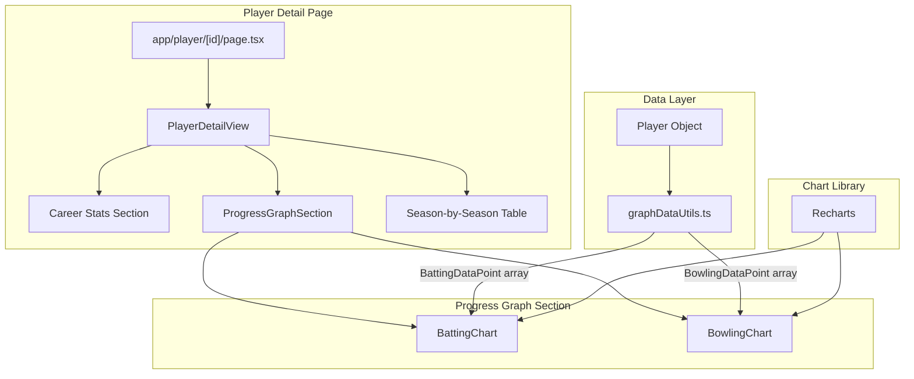

# Design Document: Player Progress Graphs

## Overview

This feature adds interactive line/bar charts to the player detail page (`/player/[id]`) that visualize season-over-season batting and bowling performance trends for IPL players across the 2022–2025 seasons. Charts are role-aware: batters see batting charts prominently, bowlers see bowling charts prominently, and all-rounders see both. The feature integrates a lightweight charting library (Recharts) into the existing Next.js + TypeScript + Tailwind CSS stack.

Key goals:
- Provide at-a-glance trend visualization for batting (runs, average, strike rate) and bowling (wickets, economy, average) stats
- Adapt chart display based on player role (primaryRole + secondaryRole)
- Ensure charts are responsive, accessible, and interactive (tooltips on hover)
- Keep data transformation logic pure and testable, separate from rendering

## Architecture



### Key Design Decisions

1. **Recharts as charting library** — Recharts is a React-native charting library built on D3 with declarative components. It's lightweight, supports responsive containers, has built-in tooltip/legend support, and works well with Next.js client components. No other charting library is currently installed.

2. **Pure data transformation** — A `graphDataUtils.ts` utility extracts season data from `Player` objects into typed chart-ready arrays. This keeps chart components thin and the transformation logic independently testable.

3. **Role-based chart visibility** — The `ProgressGraphSection` component determines which charts to show based on `primaryRole`, `secondaryRole`, and actual data availability. This logic is extracted into a helper function `getChartVisibility` for testability.

4. **Placement between existing sections** — The graph section slots between Career Stats and the Season-by-Season table, maintaining the existing page flow from summary → visual trends → detailed data.

5. **Responsive layout** — Two-column grid on screens ≥640px, single-column stack below. Recharts' `ResponsiveContainer` handles chart width adaptation.

## Components and Interfaces

### New Components

| Component | Props | Responsibility |
|---|---|---|
| `ProgressGraphSection` | `player: Player` | Determines which charts to render based on role and data availability. Renders heading "Performance Trends" and chart grid layout. |
| `BattingChart` | `data: BattingDataPoint[], playerName: string` | Renders a composed chart with bars for runs and lines for average and strike rate. Includes tooltip, legend, and ARIA label. |
| `BowlingChart` | `data: BowlingDataPoint[], playerName: string` | Renders a composed chart with bars for wickets and lines for economy and average. Includes tooltip, legend, and ARIA label. |

### New Utility Functions

| Function | Signature | Description |
|---|---|---|
| `transformBattingData` | `(player: Player) => BattingDataPoint[]` | Extracts batting stats from seasons that have batting data, sorted by year ascending. |
| `transformBowlingData` | `(player: Player) => BowlingDataPoint[]` | Extracts bowling stats from seasons that have bowling data, sorted by year ascending. |
| `getChartVisibility` | `(player: Player) => { showBatting: boolean; showBowling: boolean; battingPrimary: boolean }` | Returns which charts to display and which is primary, based on role and data availability. |

### Modified Components

| Component | Change |
|---|---|
| `PlayerDetailView` | Import and render `ProgressGraphSection` between Career Stats and Season-by-Season Stats sections. |

## Data Models

### Chart Data Point Types

```typescript
interface BattingDataPoint {
  season: string;       // e.g. "2023"
  runs: number;
  average: number;
  strikeRate: number;
}

interface BowlingDataPoint {
  season: string;       // e.g. "2023"
  wickets: number;
  economy: number;
  average: number;
}

interface ChartVisibility {
  showBatting: boolean;   // whether to render BattingChart
  showBowling: boolean;   // whether to render BowlingChart
  battingPrimary: boolean; // true = batting chart first, false = bowling chart first
}
```

### Data Flow

1. `PlayerDetailView` passes the `Player` object to `ProgressGraphSection`
2. `ProgressGraphSection` calls `getChartVisibility(player)` to decide which charts to render
3. For each visible chart, it calls `transformBattingData(player)` or `transformBowlingData(player)`
4. The transform functions filter `player.seasons` to only those with the relevant stat block, then map to the data point type, sorted by `year` ascending
5. Chart components receive the typed arrays and render using Recharts

### Mapping from Existing Types

- `BattingDataPoint.runs` ← `SeasonStats.batting.runs`
- `BattingDataPoint.average` ← `SeasonStats.batting.average`
- `BattingDataPoint.strikeRate` ← `SeasonStats.batting.strikeRate`
- `BowlingDataPoint.wickets` ← `SeasonStats.bowling.wickets`
- `BowlingDataPoint.economy` ← `SeasonStats.bowling.economy`
- `BowlingDataPoint.average` ← `SeasonStats.bowling.average`


## Correctness Properties

*A property is a characteristic or behavior that should hold true across all valid executions of a system — essentially, a formal statement about what the system should do. Properties serve as the bridge between human-readable specifications and machine-verifiable correctness guarantees.*

### Property 1: Batting data transformation completeness

*For any* Player with at least one season containing batting data, `transformBattingData` should return an array whose length equals the number of seasons with batting data, and each element should have `runs`, `average`, and `strikeRate` values matching the corresponding season's `BattingStats`.

**Validates: Requirements 1.1, 1.2, 4.2, 4.4**

### Property 2: Bowling data transformation completeness

*For any* Player with at least one season containing bowling data, `transformBowlingData` should return an array whose length equals the number of seasons with bowling data, and each element should have `wickets`, `economy`, and `average` values matching the corresponding season's `BowlingStats`.

**Validates: Requirements 2.1, 2.2, 4.3, 4.4**

### Property 3: Transform output is sorted by season ascending

*For any* Player, the arrays returned by `transformBattingData` and `transformBowlingData` should be sorted by the `season` field in ascending lexicographic order.

**Validates: Requirements 4.1**

### Property 4: Chart visibility correctness

*For any* Player, `getChartVisibility` should return:
- `showBatting = true` if and only if the player has at least one season with batting data
- `showBowling = true` if and only if the player has at least one season with bowling data
- `battingPrimary = true` if the player's primaryRole is "Batter" or secondaryRole is not "All-Rounder" with primaryRole "Batter"; `battingPrimary = false` if primaryRole is "Bowler" and secondaryRole is not "All-Rounder"

**Validates: Requirements 1.4, 2.4, 3.1, 3.2, 3.3, 3.4, 3.5**

### Property 5: Data transformation round-trip

*For any* Player, transforming season data into chart data points and then comparing each point's values back to the original season stats should yield identical numeric values (no data loss or mutation during transformation).

**Validates: Requirements 4.5**

## Error Handling

| Scenario | Handling |
|---|---|
| Player has no batting data in any season | `ProgressGraphSection` does not render `BattingChart`; no error shown |
| Player has no bowling data in any season | `ProgressGraphSection` does not render `BowlingChart`; no error shown |
| Player has no seasons at all | `ProgressGraphSection` renders the "Performance Trends" heading with no charts below it |
| Player has only one season of data | Chart renders a single data point; no crash or empty state |
| Recharts fails to render (e.g., SSR mismatch) | `ProgressGraphSection` is a client component (`"use client"`) to avoid SSR issues with Recharts |

## Testing Strategy

### Property-Based Testing

Library: **fast-check** (already installed as `fast-check@^4.6.0`)

Each property test must:
- Run a minimum of 100 iterations
- Reference its design document property with a tag comment
- Tag format: `Feature: player-progress-graphs, Property {number}: {property_text}`
- Each correctness property is implemented by a single property-based test

Property tests target the pure utility functions in `lib/graphDataUtils.ts`:
- `transformBattingData` — Properties 1, 3, 5
- `transformBowlingData` — Properties 2, 3, 5
- `getChartVisibility` — Property 4

Generators will produce random `Player` objects with varying combinations of:
- primaryRole: "Batter" | "Bowler"
- secondaryRole: undefined | "Wicket-Keeper" | "All-Rounder" | "Captain" | "Vice-Captain"
- Seasons with batting data only, bowling data only, both, or neither
- Single-season players (edge case from 1.3, 2.3)

### Unit Testing

Library: **Vitest** (already configured)

Unit tests focus on:
- Specific examples: known player data producing expected chart data points
- Edge cases: player with one season, player with no stats, all-rounder with mixed data availability
- Component rendering: `ProgressGraphSection` renders correct heading text ("Performance Trends"), ARIA labels present on chart containers, correct chart visibility for known player roles
- DOM ordering: graph section appears between career stats and season table

### Test Organization

```
__tests__/
  utils/
    graphDataUtils.test.ts     — Property tests for transform functions and chart visibility
  components/
    ProgressGraphSection.test.tsx — Unit tests for rendering, layout, ARIA labels
```

### Test Coverage Goals

- All 5 correctness properties implemented as property-based tests
- Unit tests for each edge case (single season, no data, mixed roles)
- Component tests for ARIA labels, heading text, and section placement
